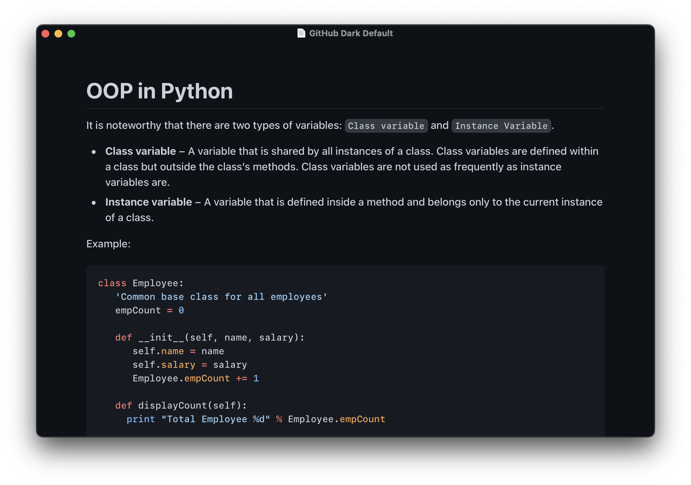
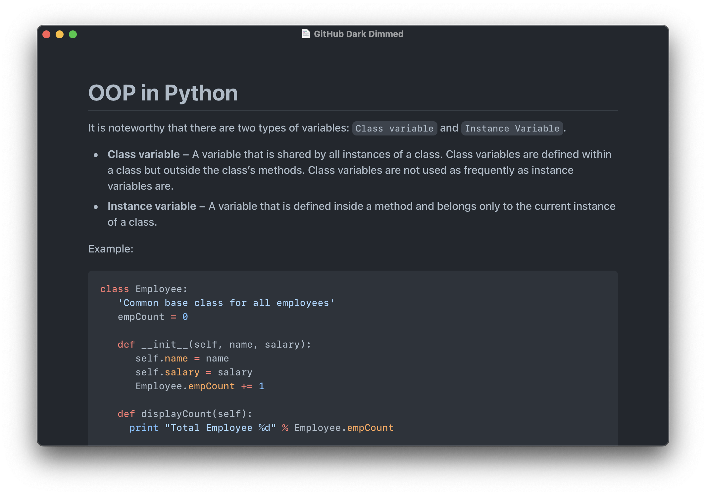
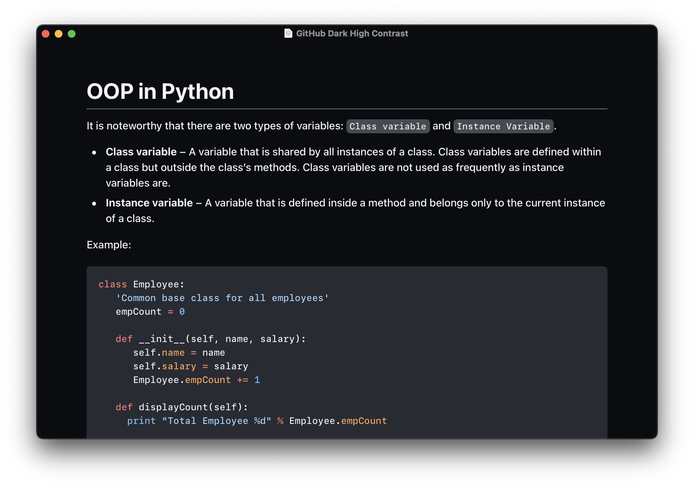

# GitHub Dark Themes for Typora

Hi folks! This repository contains Typora themes that are based on GitHub Dark Default, Dark Dimmed, and Dark High-Contrast. These themes were initially created by [Kinoute](https://github.com/kinoute/typora-github-night-theme), but have since been enhanced to provide a more authentic GitHub experience. For example, the themes now use `system-ui` as the main font instead of Nunito, and `ui-monospace` for code (as GitHub do).

In addition, several other improvements have been made to the themes, such as enhanced code block border-radius, colors, list spacing, text line height, font weight, and checkboxes, among other enhancements.

## Installation

1. Download the chosen theme(s) or the [last release](https://github.com/Zabriskije/Typora-GitHub-Themes/releases/latest)
1. Launch Typora and go to `Settings...` → `Appereance` → `Open Theme Folder`
1. Copy the selected files to the `themes` folder and restart Typora
1. Click on `Themes` from the Mac Menu Bar
1. Select the preferred theme
1. Enjoy!
